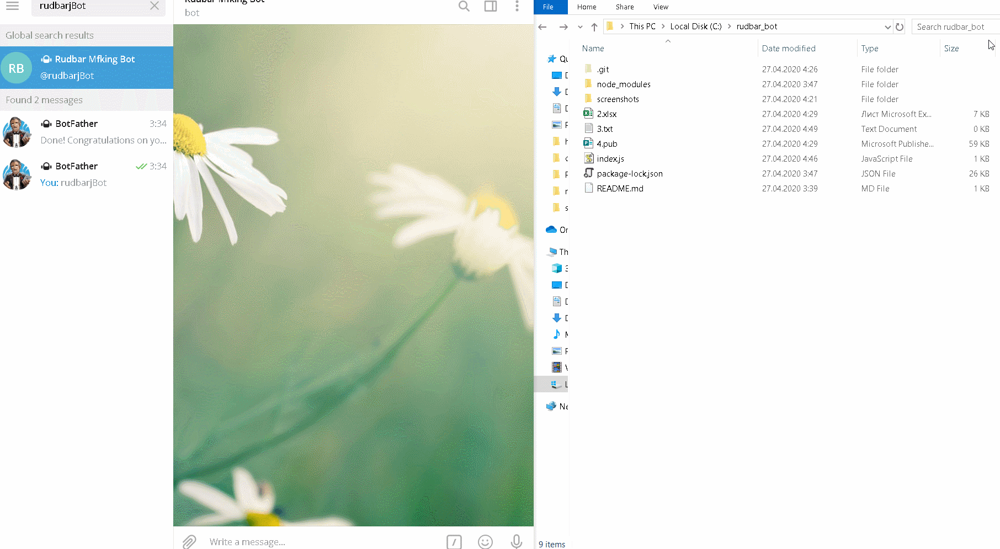
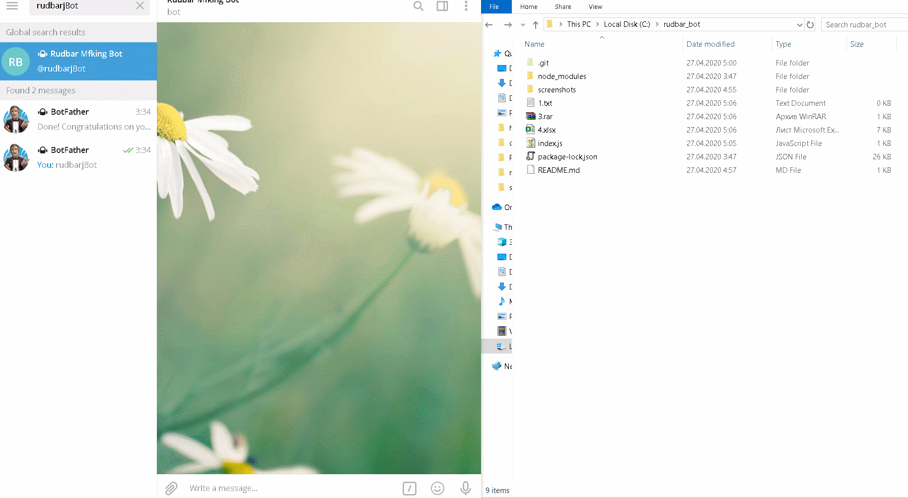
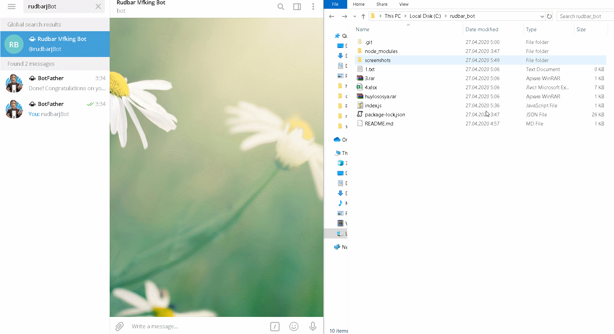

# rudbar_bot
A telegram bot for doing tasks on your PC remotely

The first test went successfully:

The bot can delete any file in the specified directory, so do be careful:

It also can copy the file in the current directory:

And it can list the files in any given directory on your machine:

Big thank you to https://github.com/yagop for his https://github.com/yagop/node-telegram-bot-api repository.

Love ya'll ❤️❤️❤️
